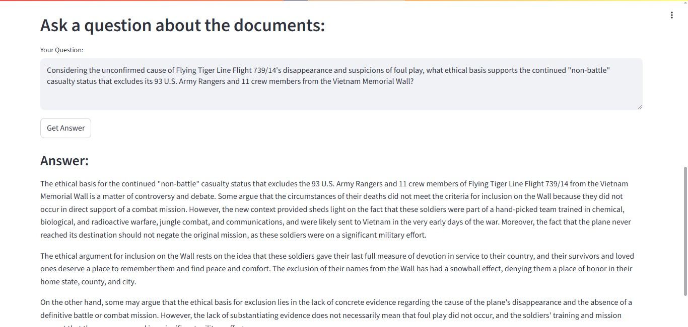

# RAG Project: Domain Specific Q & A with Advanced Retrieval



<br>

## The Foundation

### Project Tagline
An intelligent Q & A system that provides accurate, context-aware, answers from a specialized knowledge base, minimizing LLM hallucinations.

### Elevator Pitch: What It Is and Why It Matters
* This project implements a Retrieval-Augmented Generation (RAG) system designed to answer user queries based only on a provided set of domain-specific documents.

* In an era where Large Language Models (LLMs) can sometimes "hallucinate" or generate incorrect information, this RAG application offers a robust solution by grounding LLM responses in verifiable facts from a curated knowledge base.  
    This ensures accuracy and relevance, making it ideal for scenarios requiring precise information retrieval from specific data sources, such as technical manuals, research papers, or internal company documents.

### Badge
**License:** [MIT License](https://opensource.org/license/mit)


## Getting Started

### For the Non-Technical User (The "Easy" Button)
Unfortunately, due to the significant computational resources required to run the full RAG pipeline locally (specifically, loading the large language model and reranker), it is not feasible to provide a live, free-tier hosted demo of this application. Deploying such a setup would exceed the limits of readily available free hosting services.
<br>
<br>
However, the "rag_app.py" code is designed to be runnable locally if you have the necessary hardware (e.g., a GPU with sufficient VRAM).
<br>
Alternatively, for those with a Google account, this project can also be run interactively using Google Colab, which provides access to free GPU resources.
<br>
For a detailed explanation of how the application functions and to see its capabilities, please refer to the "**For the Technical User (The 'Under the Hood' Guide)**" section below, which outlines the setup process.
<br>
Comprehensive usage examples are there to illustrate the user experience
and the project's output.
<br>
<br>
I understand the importance of a live demo and am exploring alternative solutions for the future deployment.
<br>
In the meantime, the provided codebase and the detailed technical documentation should offer a clear understanding of the project's functionality and its value proposition.

### For the Technical User (The 'Under the Hood' Guide)

**Prerequisite**

1. Python 3.11.4 (or a compatible version, e.g., 3.11+)
2. pip (Python Package Installer)
3. Basic understanding of command line interfaces.
<br>
<br>

A. **Installation and Setup (With a Local GPU having sufficient VRAM)**


*Step 1: Clone the repository:*

```bash
git clone https://github.com/Asmit-cloud/Mistral-RAG-with-ChromaDB.git
cd Mistral-RAG-with-ChromaDB
```

*Step 2: Create and activate a Virtual Environment (Recommended):*

```bash
python -m venv venv
source venv/bin/activate  # On Windows, use `venv\Scripts\activate`
```

*Step 3: Install Dependencies:*

```bash
pip install -r requirements.txt
```

*Step 4: Place knowledge base files:*

Ensure the CRUZ_TEXAS_cleaned.txt and N6921C_cleaned.txt files are present in the root of your project, alongside rag_app.py.

*Step 5: Run the application:*

```bash
streamlit run rag_app.py
```

This will open the Streamlit application in your web browser.
<br>
<br>
B. **Installation and Setup (With Google Colab)**

For a convenient, cloud-based setup that leverages free GPU resources, you can run this application in Google Colab.

**Note:** Google Colab provides temporary environments. If your session disconnects, you may need to re-run the setup steps.

**Colab Environment:** While running this RAG application in Google Colab if you encounter any installation or runtime issues, please refer to the provided `rag_app.ipynb` notebook.  
This notebook contains the exact steps and necessary commands used to successfully set up and run the application within the Colab environment, addressing common dependency resolution challenges specific to Colab.

*Step 1: Open a new Google Colab notebook:*
* Go to [Google Colab](https://colab.research.google.com).
* Click `File` -> `New Notebook`.

*Step 2: Mount Google Drive:*
<br>
While not strictly necessary for the `CRUZ_TEXAS_cleaned.txt` and `N6921C_cleaned.txt` if you upload them directly, but mounting your Google Drive can be useful for larger projects or persistent data.

```python
from google.colab import drive
drive.mount('/content/drive')

# If you mount your drive, adjust the file paths in `rag_app.py` accordingly.
# E.g., cruz_file_path = "/content/drive/My Drive/rag_project_folder/CRUZ_TEXAS_cleaned.txt"
```

*Step 3: Install Dependencies:*
<br>
Run the following cell in your Colab notebook to install all the necessary Python packages.

```python
!pip install -q -r requirements.txt

# Due to specific Colab environment characteristics, additional installations are necessary for this RAG application
# These installations ensure proper dependency resolution and avoid potential runtime errors, even if some packages are listed in requirements.txt
!pip install -q jedi
!pip install -q llama-index
!pip install -q llama-index-llms-huggingface
!pip install -q llama-index-postprocessor-colbert-rerank
!pip install -q llama-index-vector-stores-chroma
!pip install -q llama-index-embeddings-huggingface
!pip install -q ngrok
```

*Step 4: Upload the knowledge base files:*
<br>
You need to upload `CRUZ_TEXAS_cleaned.txt` and `N6921C_cleaned.txt` to your Colab environment.

* In the left sidebar, click the folder icon to open the file browser.

* Click the `Upload to session storage` icon and select your `CRUZ_TEXAS_cleaned.txt` and `N6921C_cleaned.txt` files. Ensure they are in the `/content/` directory (the default working directory) or adjust the `rag_app.py` file paths accordingly.

*Step 5: Set up Google Colab secrets for API keys:*
<br>
To securely use the API keys without hardcoding them, leverage Google Colab Secrets.


* In your Colab notebook, click the `🔑` icon (Secrets) in the left sidebar.

* Click `Add new secret`.
* **For HuggingFace:**
    * Name: `HF_TOKEN`
    * Value: Your HuggingFace API Token (obtainable from [Hugging Face Settings -> Access Tokens](https://huggingface.co/settings/tokens)). This is required for downloading models, which have acceptance agreements.
* **For ngrok:**
    * Name: `NGROK_AUTH_TOKEN`
    * Value: Your ngrok Authtoken (obtainable from [ngrok Dashboard -> Your Authtoken](https://dashboard.ngrok.com/get-started/your-authtoken)).
    
* Ensure `Notebook access` toggle is enabled for both the secrets.

*Step 6: HuggignFace Login:*

```python
!pip install -q bitsandbytes
!pip install -q huggingface_hub

from huggingface_hub import login
from google.colab import userdata

try:
    hf_token = userdata.get('HF_TOKEN')
    if hf_token:
        login(token=hf_token)
        print("Logged in to HuggingFace using Colab Secret.")
    else:
        print("HF_TOKEN not found in Colab Secrets. Model downloads might be limited.")
except Exception as e:
    print(f"Error logging in to HuggingFace: {e}")
    print("Please ensure 'HF_TOKEN' is set in Colab Secrets with 'Notebook access' enabled.")
```

*Step 7: ngrok authentication:*

```python
!pip install -q pyngrok

from google.colab import userdata

try:
    ngrok_auth_token = userdata.get('NGROK_AUTH_TOKEN')
    if ngrok_auth_token:
        # This command saves the authtoken to ngrok's configuration file
        get_ipython().system(f"ngrok config add-authtoken {ngrok_auth_token}")
        print("ngrok authtoken added")
    else:
        print("NGROK_AUTH_TOKEN not found in Colab Secrets.")
except Exception as e:
    print(f"Error loading NGROK_AUTH_TOKEN from Colab Secrets: {e}")
    print("Please ensure 'NGROK_AUTH_TOKEN' is set in Colab Secrets with 'Notebook access' enabled.")
```

*Step 8: Run ngrok and Streamlit application:*

```python
# "&>/dev/null&": Redirects output to null and runs in background, so that Colab doesn't get stuck.
!streamlit run rag_app.py &>/dev/null&

# Start ngrok tunnel for Streamlit (default Streamlit port is 8501)
# The public URL will be printed below.
public_url = ngrok.connect(addr="8501", proto="http")
print(f"Streamlit App Public URL: {public_url}")
```

### Accessing the Streamlit Web UI

For demonstration purposes, this Streamlit application might be exposed via a temporary ngrok tunnel when run in certain environments (e.g., Google Colab).

**Important Note for Accessing the Demo:**

If you are accessing the application's URL for the first time, you might encounter a **"You are about to visit..." warning page** from `ngrok.com`. This is a standard security measure for ngrok's free tier and does **not** indicate any issue with the application itself.

Please simply click the **"Visit Site"** button to proceed to the RAG application. This warning typically appears only once per browser session.

If you are interacting with the application programmatically (e.g., via `curl` or a Python `requests` script) and encounter issues, you might need to include the `ngrok-skip-browser-warning` header in your requests to bypass this page:

```bash
curl -H "ngrok-skip-browser-warning: 1" YOUR_NGROK_PUBLIC_URL/your_endpoint
```


## Unveiling the Features: Functionality for Everyone

### Key Features (The "Wow" Factors)

* **Accurate & Contextual Answering:** Provides precise answers derived only from the provided domain-specific documents.
* **Domain Specificity:** Focuses answers exclusively within the loaded knowledge base and can indicate when information is unavailable.
* **Intuitive Web Interface:** An user-friendly Streamlit Interface for seamless interaction.
* **Efficient knowledge base ingestion:** Automated pipeline for data acquisition, text chunking, embedding generation, and vector database storage.
* **Advanced Retrieval Mechanism:** Utilizes simantic similarity search and a reranking model to fetch the most relevant document chunks.
* **Augmented Generation:** Integrates with a powerful LLM (Mistral-7B-Instruct-v0.2) to synthasize answers using retrieved context, mitigating hallucinations.
* **Robust Error Handling:** Gracefully manages queries outside the knowledge base scope and provides clear user feedback.

### Usage Examples

Once the Streamlit application is running, you can interact with it through the web interface.

1. **Simple Scenario:**

Type a question directly related to the content of CRUZ_TEXAS_cleaned.txt or N6921C_cleaned.txt.

*Example Question:* "What is the tail number of the aircraft?"

Click "Get Answer."

The system will provide a concise answer based on the loaded documents.

2. **Advanced Scenario:**

The system is designed to handle more nuanced queries and indicate when information is not found.

A. *Example Question (within scope):* "Can you tell me about the flight details of N6921C?"

Expected Output: An answer detailing flight information from N6921C_cleaned.txt, along with the source chunks.

B. *Example Question (outside scope):* "What is the capital of France?"

Expected Output: The system should indicate that it cannot answer this question as the information is not present in its domain-specific knowledge base.


## Diving Deeper

### Technical Stack

1. *Programming Language:* Python 3.11.4

2. *Web Framework:* Streamlit

3. *LLM Framework:* LlamaIndex

4. *Embedding Model:* BAAI/bge-large-en-v1.5 (HuggingFaceEmbedding)

5. *Large Language Model (LLM):* mistralai/Mistral-7B-Instruct-v0.2 (HuggingFaceLLM)

6. *Vector Database:* ChromaDB (persistent client)

7. *Reranker Model:* BAAI/bge-reranker-large (ColbertRerank)

8. *Quantization:* BitsAndBytesConfig (4-bit quantization)

### Project Structure

```
├── image/
│     └── ScreenshotRAG.jpg
├── CRUZ_TEXAS_cleaned.txt
├── N6921C_cleaned.txt
├── README.md
├── rag_app.ipynb
├── rag_app.py
└── requirements.txt
```

### Regarding Development Environment

As the sole developer for this project, I want to provide a brief update on my current capacity.  
I will soon be transitioning to an alternative development environment.

While this presents a temporary change in my setup, I am fully committed to continuing development and support for this project to the best of my ability. Future updates may be less frequent or structured differently during this period, but my dedication to improving the RAG program remains.

I appreciate your understanding as I adjust to these changes in my development environment.

### Current Scope & Future Enhancements

Due to the tight development timeline, the current RAG implementation utilizes a knowledge base with two initial files. I plan to significantly expand this knowledge base in future iterations to enhance the program's comprehensiveness and retrieval performance.


## Contributing and Support


This RAG project welcomes contributions to enhance itself!

### How to Contribute

* Fork the repository.

* Create a new branch for your feature or bug fix.

* Make your changes and ensure they adhere to good coding practices (PEP-8).

* Write clear commit messages.

* Submit a pull request with a detailed description of your changes.

**Code of Conduct:** To foster a welcoming and inclusive environment, please review the [Code of Conduct](CODE_OF_CONDUCT.md). All interactions within this project are expected to adhere to these guidelines.


### Support Channels: 

For any issues or questions, please open an issue on the GitHub repository.


## Essential Information

* **License:** [MIT License](LICENSE)

* **Author and Acknowledgments:**

    * **Author:** Asmit De
    
    * **Acknowledgements:** Special thanks to the developers of Streamlit, LlamaIndex, HuggingFace, ChromaDB, and the BAAI community for their incredible tools and models.

* **Contact Information:** [Email](mailto:byte.100.tron@gmail.com) me for inquiries.


## Project Highlights and Learnings

<br>
This project served as a hands-on exploration of building a functional RAG pipeline. Key design choices and learnings include:

**Chunking Strategy**: Employed a chunking strategy with a chunk_size of 2000 and chunk_overlap of 300. This was chosen to allow for larger contexts to be considered while still providing sufficient overlap for continuity, aiming to balance retaining semantic meaning within chunks while ensuring they are suitable for effective retrieval and LLM context window limits.

**Embedding Model Selection:** The "BAAI/bge-large-en-v1.5" embedding model was selected for its strong performance in semantic similarity tasks, crucial for accurate retrieval.

**LLM Integration:** Integrated "mistralai/Mistral-7B-Instruct-v0.2" with 4-bit quantization (BitsAndBytesConfig). This was a critical decision to allow running a powerful LLM locally with reduced memory footprint, addressing potential limitations of local environments like Google Colab or Kaggle. The context_window was set to 7000 and max_new_tokens to 4096, providing a generous working space for the LLM. Prompt engineering was carefully applied to instruct the LLM to answer only from the provided context, combating hallucinations.

**Vector Database Choice:** ChromaDB was chosen for its ease of setup as a persistent local vector store.

**Reranking with ColbertRerank:** The "BAAI/bge-reranker-large" was implemented as a post-processor to refine the initial retrieval results. This significantly improves the relevance of the chunks passed to the LLM, leading to more accurate and focused answers.

## Challenges and Overcoming Them


**LLM Memory Constraints:** Running large models locally can be memory-intensive. 4-bit quantization was essential to make Mistral-7B-Instruct-v0.2 feasible on consumer-grade hardware.

**Context Window Management:** Balancing chunk_size (2000) and top_k retrieval with the LLM's context_window (7000 tokens for Mistral) was key to ensuring all relevant information fit while avoiding truncation, especially with the increased chunk sizes. The max_new_tokens of 4096 also played a role in managing the output length.